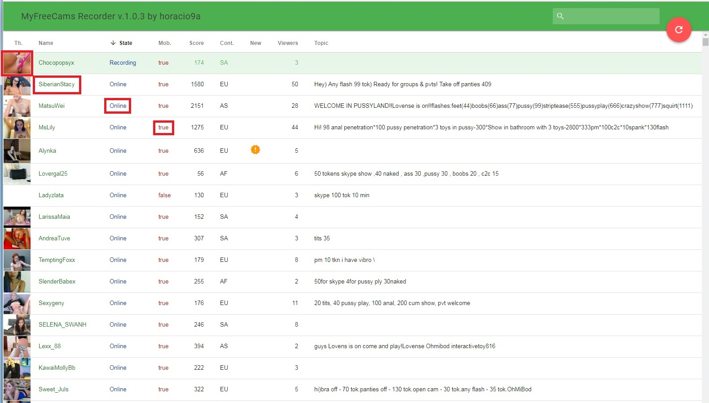
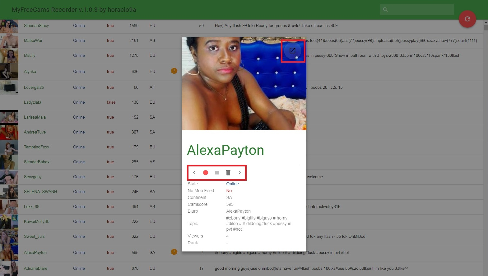
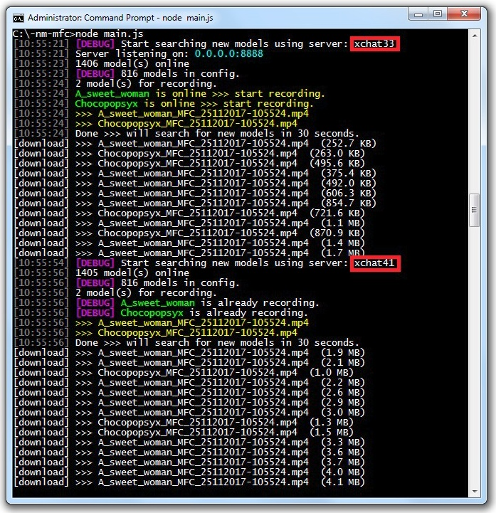

mfc-node-recorder
=================
Note: mfc-node lets you follow and record your favorite models shows on myfreecams.com

mfc-node
==========
This is an attempt to create a script similar to [capturbate-node](https://github.com/SN4T14/capturebate-node) based on different pieces of code found on the Internet.

Credits:
* [capturbate-node](https://github.com/SN4T14/capturebate-node)
* [Sembiance/get_mfc_video_url.js](https://gist.github.com/Sembiance/df151de0006a0bf8ae54)
* [mfc-node](https://github.com/sstativa/mfc-node)

Requirements
============
1. [Node.js](https://nodejs.org/download/release/) used to run mfc-node, hence the name. (tested with node v8.1.3)
2. [Livestreamer](https://github.com/chrippa/livestreamer/releases) last version 1.12.2 It's best to be in C:/Livestreamer
3. [Streamlink](https://github.com/streamlink/streamlink) last version 0.9.0 better to install it independently (not in python)
4. [ffmpeg](https://ffmpeg.zeranoe.com/builds/) must be a last version somewere in the path.

Setup
=====
1. Install [Node.js](https://nodejs.org/download/release/) (v8.1.3 or higher).
2. Install [Git](https://git-scm.com/downloads).
2. Download and unpack the [code](https://codeload.github.com/horacio9a/mfc-node/zip/master), create directory 'C:/-nm-mfc' and move all files from 'rar' there.
3. Open console and go into the default directory ('C:/-nm-mfc') where are located unpacked files.
4. Install requirements by running 'npm install' in the same directory as 'main.js' is.
5. Edit 'config.yml' file and set desirable values for 'captureDirectory', 'dateFormat', 'downloadProgram', 'modelScanInterval' and others data.

Running
=======
1. Open console and go into the directory where is 'main.js'.
2. Start program with 'node main.js'.
3. Open http://localhost:8888 in your browser.

- The online model list can be sorted by various criteria (default is 'state' because at the top are the models currently being recorded). Thumbnails of models ('menu' small preview) with camscore greater than 700 will be displayed immediately. After about 60 seconds, thumbnails of other models will be visible when the mouse cursor is hover and will be updated.
- If you want to look at some of the models, click on the model name and a 'spinner' will appear with the model image in resolution 400x300 with all available model data.
- If you want to start recording, you need to click the red button ('Japanese flag'). If you want to stop recording, you need to click the stop button (right of the red button). 
- All this can be done online and track what is happening on the console, and you can view recorded file immediately if you start some media player, for example VLC.
- When you click on a preview thumbnail the large image is obtained in the next tab of your browser.
- The MFC Recorder now captures the MFC streams with three different programs (livestreamer, streamlink and ffmpeg) depending on the data in config.yml ('ls', 'sl', 'ff-ts' or 'ff-flv'). Currently it is better to use 'livestreamer' or 'streamlink' because they do not have the so-called 'freeze' problem as it currently has 'ffmpeg' for some models.
- Livestreamer and streamlink produce 'mp4' files and 'ffmpeg' produce 'flv' or 'ts' depending on the choice in the 'config.yml'.
- Lot of people are asking, so I added the option that every model now has its own subdirectory
- By pressing 'State/Online' you can enter in the model room with your browser.
- By pressing the model 'Mob./true' you get a video preview of the current model in separate window of your browser. For this feature in My recommendation is to use the Chrome browser with the installed add-on [Play HLS M3u8](https://chrome.google.com/webstore/detail/play-hls-m3u8/ckblfoghkjhaclegefojbgllenffajdc/related) but if you want firefox then need to install [Native HLS Playback](https://addons.mozilla.org/en-US/firefox/addon/native_hls_playback/)
- If we already have to look at the lines of livestreamer and streamlink I made it to look better and to be useful because we will now know how is big files we are currently recording. This can be of help with other downloadings that we do with livestreamer and streamlink. In your instalation you must found:

   ... /livestreamer_cli/utils/progress.pyc
   or
   ... /streamlink_cli/utils/progress.py

   ... and owerwrite existing files with 'progress.py' on this page.


The list of online models will be displayed with a set of allowed commands for each model:
	Include - if you want to record the model
	Exclude - if you don't want to record the model anymore
	Delete - if you are not interested in the model and wanna hide her permanently

This is not a real-time application. Whenever your 'include', 'exclude' or 'delete' the model your changes will be applied only with the next iteration of 'mainLoop' function of the script. 'mainLoop' runs every 30 seconds (default value for 'modelScanInterval').
There is no 'auto reload' feature, you have to reload the list manually with 'big red button', however, keep in mind the script updates the list internally every 30 seconds ('modelScanInterval'), therefore sometimes you'll have to wait 30 seconds to see any updates.
Be mindful when capturing many streams at once to have plenty of space on disk and the bandwidth available or you’ll end up dropping a lot of frames and the files will be useless.

For advanced users
===========
There are several special URLs that allow implementing some operations with a model even if she is offline.

__Include__
```
http://localhost:8888/models/include?nm=modelname
http://localhost:8888/models/include?uid=12345678
```
__Exclude__
```
http://localhost:8888/models/exclude?nm=modelname
http://localhost:8888/models/exclude?uid=12345678
```
__Delete__
```
http://localhost:8888/models/delete?nm=modelname
http://localhost:8888/models/delete?uid=12345678
```
Places that can be clicked



New look of 'spinner'



Look after replacement of 'progress.py'



